# AccessHub – Network Access Management System
**AccessHub** is a Laravel-based network access management and automation system designed to simplify the management of internet access codes across multiple labor camps.

The system integrates with Google Sheets and **MikroTik RouterOS** to synchronize access-code data, manage hotspot users, and perform network operations from a centralized web application.

AccessHub also provides a **Laravel Sanctum API** that connects with a separate Flutter mobile application used by sales personnel.

--- 

## Overview
AccessHub was developed to reduce manual work involved in managing internet access codes and MikroTik hotspot users.

The system can retrieve access-code information from Google Sheets, store the required data in a centralized database, communicate directly with MikroTik routers, and provide controlled access to sales personnel through both the web application and mobile application.

**Main Integrations**
- Google Sheets / Google Apps Script
- MikroTik RouterOS API
- MySQL Database
- Laravel REST API
- Flutter Mobile Application

--- 

## Key Features

### Google Sheets Integration

AccessHub communicates with Google Sheets through Google Apps Script to automate data synchronization.

- Fetch data from Google Sheets
- Create new rows and records
- Update existing rows
- Synchronize required spreadsheet data with the application database
- Reduce manual data entry

This allows existing spreadsheet-based workflows to work together with the centralized web system.

### MikroTik RouterOS Integration

AccessHub communicates directly with MikroTik routers using the RouterOS API.

The system can:

- Fetch MikroTik User Manager data
- Create and update User Manager data
- Retrieve hotspot user information
- Check user status
- Bind MAC addresses
- Unbind MAC addresses
- Perform network access management operations

This integration allows network operations to be performed directly from the application instead of requiring manual MikroTik administration.

### Multi-Camp Management

AccessHub supports multiple labor camps within a single system.

- Manage multiple camps
- Assign users and operations to specific camps
- Restrict users according to their assigned camp
- View camp-specific information
- Manage network access across different camp locations

### Role-Based Access Control

The system provides role-based and camp-based access control.

Users can be restricted according to:

- User role
- Assigned camp
- Available system permissions

This ensures that sales personnel can access only the information and operations relevant to their responsibilities.

### Dashboard & Data Management

AccessHub provides a centralized dashboard for monitoring and managing system data.

Features include:

- Dashboard statistics
- Data visualization
- Searchable data tables
- Filtering and sorting
- Record management
- Camp-specific data views

### Mobile Application Integration

AccessHub provides a REST API for a separate Flutter mobile application used by sales personnel.

The mobile application communicates with AccessHub using Laravel Sanctum token authentication.

Mobile Application

The separate mobile application allows authorized sales personnel to perform selected network-access operations from their mobile devices.

The mobile application is maintained in a separate repository.

- API Technologies
- Laravel REST API
- Laravel Sanctum
- Bearer Token Authentication
- Flutter
- Dio
- Provider

--- 

## Technology Stack
- Laravel 12 - Backend framework
- PHP - Application development
- Blade - Web interface
- MySQL - Database
- MikroTik RouterOS API - Network and hotspot management
- Google Apps Script - Google Sheets integration
- Laravel Sanctum - Mobile API authentication
- REST API - Web/mobile communication
- Tailwind CSS - User interface
- JavaScript - Frontend interactions

--- 
## Architecture Highlights

AccessHub demonstrates several real-world application development concepts:

### Third-Party System Integration

The application integrates multiple external systems:

AccessHub
   │
   ├── Google Sheets
   │      └── Google Apps Script
   │
   ├── MikroTik
   │      └── RouterOS API
   │
   └── Flutter Mobile Application
          └── Laravel Sanctum API
### API Authentication

The mobile application uses Laravel Sanctum personal access tokens to securely communicate with protected API endpoints.

### Camp-Level Authorization

Authorization is not limited to application roles. Access can also be restricted according to the user's assigned camp.

--- 

## Screenshots

  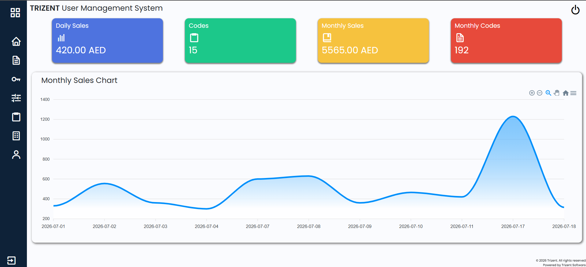
  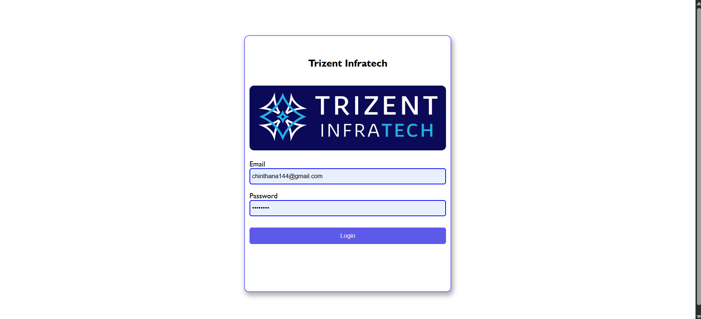

  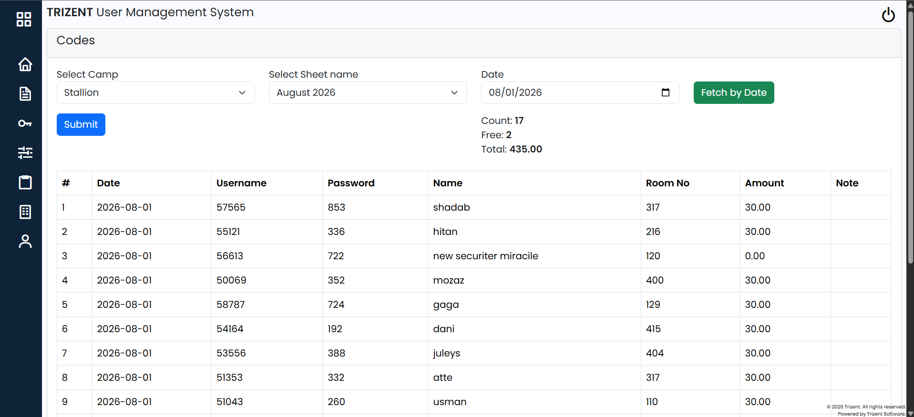
  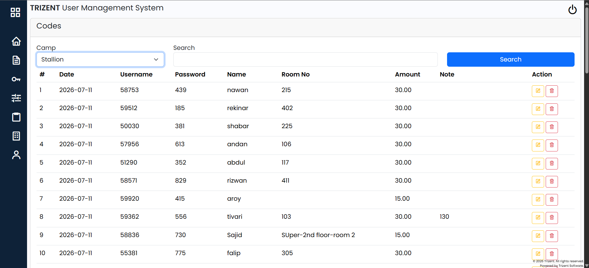

  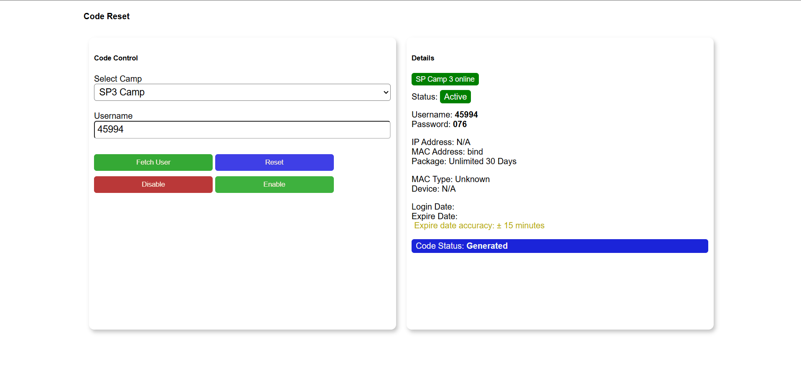
  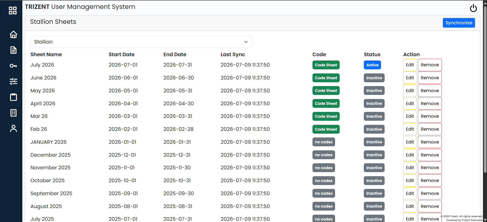

  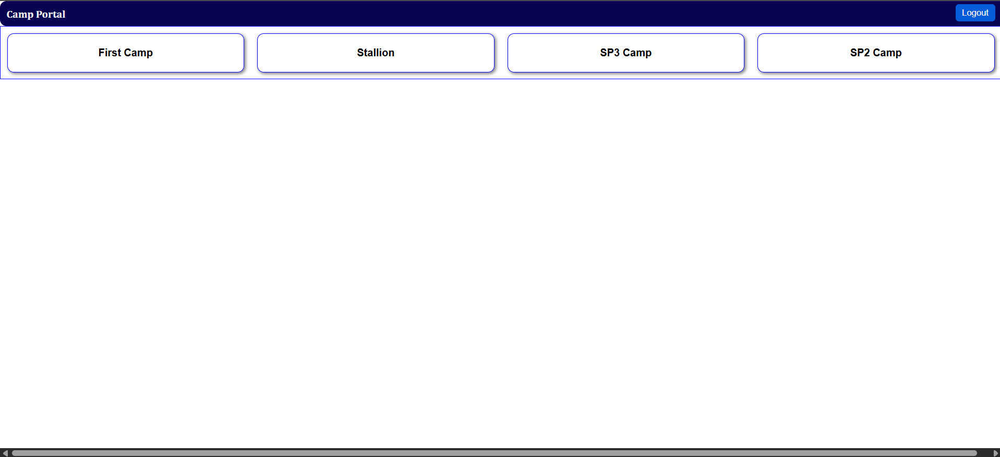
  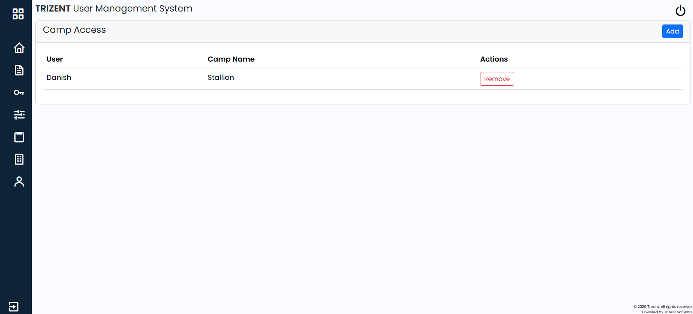

  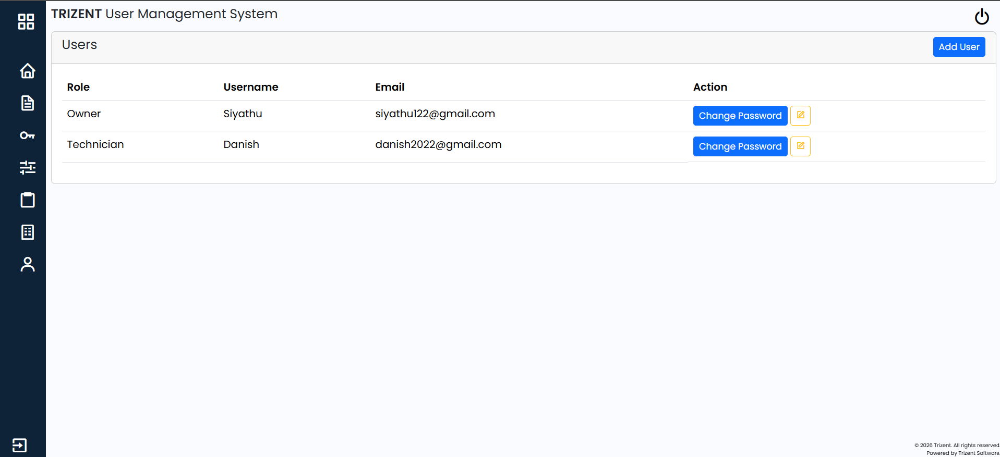
  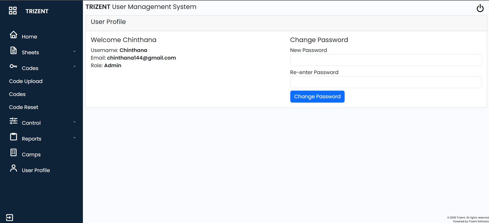

  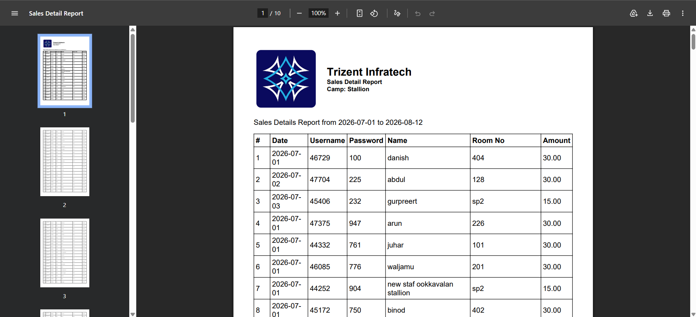
  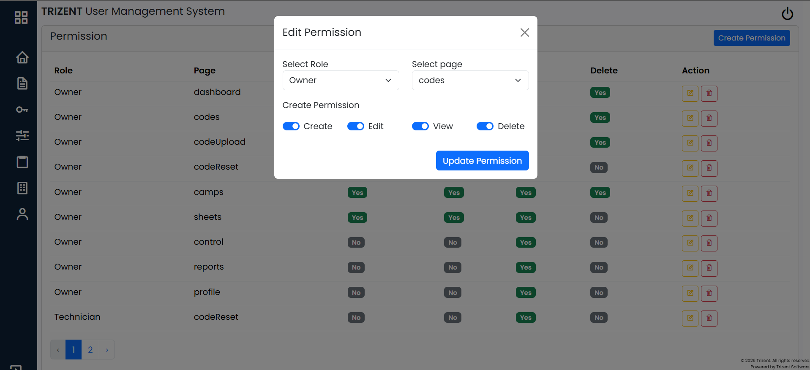

--- 

## Installation
1. Clone the Repository
    git clone https://github.com/Chinthana144/AccessHub.git
    cd accesshub

2. Install PHP Dependencies
    composer install

3. Install Frontend Dependencies
    npm install
    npm run build

4. Configure Environment

Copy the example environment file:

    cp .env.example .env

Generate the application key:

    php artisan key:generate

Configure the required environment variables, including:

- Database connection
- Application URL
- MikroTik API credentials
- Google Sheets / Apps Script configuration
- Sanctum configuration

5. Run Database Migrations
    php artisan migrate

6. Start the Application
    php artisan serve

The application will be available at:

    http://127.0.0.1:8000

--- 

## Security

Sensitive credentials should never be committed to the repository.

The following should be stored in environment variables or secure configuration:

- Database credentials
- MikroTik credentials
- API credentials
- Authentication secrets
- Google integration credentials

Make sure .env is included in .gitignore.

--- 

## Purpose

AccessHub was developed to automate and centralize network-access management operations that previously required manual interaction with spreadsheets and MikroTik systems.

The project demonstrates practical experience with:

- Laravel application development
- REST API development
- Third-party API integration
- Network management
- MikroTik RouterOS
- Database management
- Authentication and authorization
- Multi-location access control
- Mobile application integration
- Business process automation

--- 

## Future Improvements

- Real-time network monitoring
- Advanced reporting and analytics
- Automated notifications
- More network-device integrations
- Expanded mobile application functionality
- Improved synchronization monitoring

--- 

## Connect with me
- LinkedIn: *www.linkedin.com/in/chinthana-edirisinghe-42399321a*
- Email: *chinthana144@gmail.com* 

Thanks for visiting my profile!